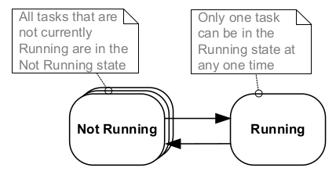

<!-- $theme: gaia -->
<!-- template: invert -->

Task Management and Software Timer in
FreeRTOS:tm:
===


**TEAM 1** - AnhDD3, BìnhTH2, KhoaHV1, ThiệnVV

---
<!-- page_number: true -->
### Content

1. Scheduling Algorithms
2. Task Management API
3. Time Management and Software Timer
4. Software Timer Demo

---
<!-- *page_number: false -->
# Scheduling Algorithms in FreeRTOS:tm:

---
## Basic Concepts
### Task

- **Task**: a small program thinks that it has the CPU all to itself:
    - implemented as C function: return void and take void pointer parameter
    - an entry point
    - normally run forever within infinite loop
    - no `return` statement

---
### Task (continued)

- From a single task function definition, OS can create a various number of *instances*.
- Each instance has its own stack and set of CPU registers.
```c
void simpleTask(void *params)
{
    int32_t localVar = 0;
    static int32_t sharedVar = 0;
    while (true)
    {
        /* The code implements the task functionality */
    }
    vTaskDelete(NULL);
}
```

---
### States and States Transitions

- *Running State*: the processor is executing the task's code
- *Not Running State*: the task's status having saved ready for it to resume execution
- *Switched in* or *Swapped in*: a task transitioned from the Not Running state to the Running state
- *Switched out* or *Swapped out*: a task transitioned from the Running state to the Not Running state

---
### States and States Transitions (continued)

*Figure: Top level task states and transitions*

---
### Expanding the *Not Running* state

- *Blocked*: waiting for an event
- *Suspended*: not available to the scheduler
- *Ready*: not blocked and not suspended

---
### Full State Transition

*Figure: Full State Transition Diagram*

---
### Other definitions
- **Scheduler** or **dispatcher**: software routine that decides which Ready state task to transit into the Running state.
- **Fixed Priority**: after initialized, neither nor scheduler or task can change priority
- **Pre-emptive**: moved out of the Running state and into the Ready state
- **Time Slicing**: share processing time between tasks of equal priority

---
## Scheduling Algorithms in FreeRTOS

- Fixed Priority Pre-emptive Scheduling with Time Slicing
- Prioritized Pre-emptive Scheduling without Time Slicing
- Co-operative Scheduling

---
### Fixed Priority Pre-emptive Scheduling with Time Slicing

*Figure: Execution example 1*

---
### Fixed Priority Pre-emptive Scheduling with Time Slicing (continued)

*Figure: Execution example 2*

---
### Fixed Priority Pre-emptive Scheduling without Time Slicing

*Figure: Execution example 3*

---
### Co-operative Scheduling

*Figure: Execution example 4*

---
<!-- *page_number: false -->
# Task Management API in FreeRTOS:tm:

---
## Supporting Task Operations in FreeRTOS

- Configuring Scheduling Algorithms
- Creating and deleting tasks
- Changing priority
- Transiting task to Blocked State and Suspended State

---
### Configuring Scheduling Algorithms

- `FreeRTOSConfig.h`
    - `configUSE_PREEMPTION`: preemptive or non-preemptive
    - `configUSE_TIME_SLICING`: with or without time slicing
    - `configUSE_TICKLESS_IDLE`: optimization or not optimization power consumption.

---
### Configuring Scheduling Algorithms (continued)

- Prioritized Pre-emptive Scheduling with Time Slicing
```c
#define configUSE_PREEMPTION 1
#define configUSE_TIME_SLICING 1
```
- Configuring time slicing

```c
/* the time slice will be 10ms */
#define configTICK_RATE_HZ 100
```

---
### Configuring Scheduling Algorithms (continued)
- Prioritized Pre-emptive Scheduling without Time Slicing
```c
#define configUSE_PREEMPTION 1
#define configUSE_TIME_SLICING 0
```

- Co-operative Scheduling: `configUSE_TIME_SLICING` won't be used
```c
#define configUSE_PREEMPTION 0
```

---
## Creating Tasks

```c
BaseType_t xTaskCreate(TaskFunction_t pvTaskCode,
                       const char * const pcName,
                       uint16_t usStackDepth,
                       void *pvParameters,
                       UBaseType_t uxPriority,
                       TaskHandle_t *pxCreatedTask);
```
- `pvTaskCode`: point to the task's function
- `pcName`: task's name
- `usStackDepth`: the number of words the stack can hold
- `pvParameters`: task's parameters

---
## Creating Tasks (continued)
```c
BaseType_t xTaskCreate(TaskFunction_t pvTaskCode,
                       const char * const pcName,
                       uint16_t usStackDepth,
                       void *pvParameters,
                       UBaseType_t uxPriority,
                       TaskHandle_t *pxCreatedTask);
```
- `uxPriority`: the task's initial priority
- `pxCreatedTask`: the task handle
- Return value: `pdPASS` or `pdFAIL`

---
## Creating Tasks (continued)

```c
void task1(void *params);
void task2(void *params);
int main( void )
{
    TaskHandle_t taskHandle2 = NULL;
    xTaskCreate(task1, /* Point to the function */
                "T1",  /* Task's name */
                1000,  /* Stack depth */
                NULL,  /* No parameter. */
                1,     /* Priority 1 */
                NULL); /* Not use task handle */
    xTaskCreate(task2, "T2", 100, NULL, 1, &taskHandle2);
    /* Start the scheduler */
    vTaskStartScheduler();
    for(;;);
}
```

---
## Creating Tasks (continued)
```c
TaskHandle_t xTaskCreateStatic(TaskFunction_t pvTaskCode,
                      const char * const pcName,
                      uint32_t ulStackDepth,
                      void *pvParameters,
                      UBaseType_t uxPriority,
                      StackType_t * const puxStackBuffer,
                      StaticTask_t * const pxTaskBuffer);
```
Task's RAM is provided by app, not OS.
- `puxStackBuffer`: array of `StackType_t` variables will be used as stack
- `pxTaskBuffer`: to hold task's data structures (Task Control Block - TCB

---
## Creating Tasks (continued)
```c
TaskHandle_t xTaskCreateStatic(TaskFunction_t pvTaskCode,
                      const char * const pcName,
                      uint32_t ulStackDepth,
                      void *pvParameters,
                      UBaseType_t uxPriority,
                      StackType_t * const puxStackBuffer,
                      StaticTask_t * const pxTaskBuffer);
```

- Return task handle or `NULL`.

---
## Creating Tasks (continued)
```c
BaseType_t xTaskCreateRestricted(
        TaskParameters_t *pxTaskDefinition,
        TaskHandle_t *pxCreatedTask);
```
Create Memory Protection Unit (MPU) restricted task
- `pxTaskDefinition`: Pointer to a structure that defines the task.
- `pxCreatedTask`: Hold the task handle.
- Return `pdPASS` or any other value.

---
## Creating Tasks (continued)

```c
typedef struct xTASK_PARAMTERS
{
    TaskFunction_t pvTaskCode;
    const signed char * const pcName;
    unsigned short usStackDepth;
    void *pvParameters;
    UBaseType_t uxPriority;
    portSTACK_TYPE *puxStackBuffer;
    MemoryRegion_t xRegions[portNUM_CONFIGURABLE_REGIONS];
} TaskParameters_t;
typedef struct xMEMORY_REGION
{
    void *pvBaseAddress;
    unsigned long ulLengthInBytes;
    unsigned long ulParameters;
} MemoryRegion_t;
```

---
## Deleting tasks

```c
void vTaskDelete(TaskHandle_t pxTaskToDelete);
```

- `pxTaskToDelete`: the handle of task to delete


- Example:

```c
vTaskDelete(NULL);
vTaskDelete(taskHandle1);
```

---
## Changing priority

```c
#define INCLUDE_uxTaskPriorityGet 1
UBaseType_t uxTaskPriorityGet(TaskHandle_t pxTask);
```
- `pxTask`: the handle of the task
- Return current priority of the task

```c
#define INCLUDE_vTaskPrioritySet 1
void vTaskPrioritySet(TaskHandle_t pxTask,
                      UBaseType_t uxNewPriority);
```
- `pxTask`: the handle of the task
- `uxNewPriority`: new priority

---
## Transiting task to Blocked State

```c
void vTaskDelay(TickType_t xTicksToDelay);
```

- `xTicksToDelay`: the number of tick interruptsthat the calling task will remain in the Blocked state before being transitioned back into the Ready state

```c
/* the number of tick periods are equivalent to 200 ms */
TickType_t nTicks = pdMS_TO_TICKS(200);
vTaskDelay(nTicks);
```

---
## Transiting task to Blocked State (continued)

- The task is executed periodically with a fixed frequency

```c
void vTaskDelayUntil(TickType_t *pxPreviousWakeTime,
                     TickType_t xTimeIncrement);
```

- `pxPreviousWakeTime`: hold the time at which the task last left the Blocked state (was _woken_ up)
- `xTimeIncrement`: the frequency

---
## Transiting task to Suspended State

```c
void vTaskResume(TaskHandle_t pxTaskToResume);
void vTaskSuspend(TaskHandle_t pxTaskToSuspend);
```

- `vTaskSuspend()`: transit task to Suspended State
- `vTaskResume()`: transit task to Ready State from Suspended State

- `vTaskSuspendAll()`: suspend the scheduler
- `vTaskResumeAll()`: resume the scheduler

---
<!-- *page_number: false -->
# Time Management and Software Timer

---
## Get tick functions
- `xTaskGetTickCount()`
    - Tick count là số lần ngắt tick xảy ra từ khi bộ lập lịch khởi động
    - Hàm trên sẽ luôn trả về giá trị tick count kể từ khi nó được gọi
    - Thời gian của 1 chu kỳ tick phụ thuộc vào giá trị của `configTICK_RATE_HZ` và macro `pdMS_TO_TICKS()` dùng để chuyển mili giây sang tick
- `xTaskGetTickCountFromISR()`: Giống với hàm trên có thể gọi được bởi ISR

---
## Delay functions
- `vTaskDelay(TickType_t xTicksToDelay)`:
    - `xTicksToDelay` số ngắt tick được gọi để giữ task ở trạng thái Block trước khi chuyển sang trạng thái Ready
    - Khi tick count là 1000 và `vTaskDelay(100)` thì khi tick count là 1100 nó sẽ chuyển trạng thái

---
## Delay functions (tiếp)

- `vTaskDelayUntil()`: thoát khỏi block state trong khoảng thời gian cụ thể. Param
    + `pxPreviousWakeTimecount`: Con trỏ trỏ tới biến lưu giá trị thời gian mà task được unblock gần nhất.
    + `pxPreviousWakeTimecount`: Con trỏ trỏ tới biến lưu giá trị thời gian mà task được unblock gần nhất.
    + `xTimeIncrement`: Chu kỳ mà task được unblock

---
## Software Timer

- Các hàm của timer không thuộc nhân của HĐH
- Cho phép các hàm được thực thi ở thời gian được định trước
- Các hàm timer không được block các hàm khác
- Các hàm của Software timer sẽ được đưa vào timer access queue chứ không được gọi trực tiếp

---
## Software Timer (tiếp)

*Figure: One-shot Timer và auto Reload timer*

---
### Software timer functions
`xTimerChangePeriod()`: Thay đổi chu kỳ của timer, nếu timer đã chạy nó sẽ tính giá trị mới để tính thời gian kết thúc. Tham số:
+ `xTimer`: Timer được thay đổi
+ `xNewPeriod`: chu kỳ mới của timer
+ `xTicksToWait`: Là khoảng thời gian tối đa mà task phải ở trong trạng thái block cho đến khi timer command queue còn chỗ trống. Nếu hàm được gọi trước khi bộ lập lịch được khởi động thì `xTicksToWait` được bỏ qua.

---
### Software timer functions (tiếp)

`xTimerCreate` và `xTimerCreateStatic`: tạo ra 1 software timer mới. Tham số:
+ `pcTimerName`: Tên timer
+ `xTimerPeriod`: chu kỳ của timer
+ `uxAutoReload`: pdFalse là one stop timer, pdTrue là auto reload timer.
+ `pvTimerID`: id cho timer
+ `pxCallbackFunction`: Hàm được gọi khi timer kết thúc

---
### Software timer functions (tiếp)

- `xTimerCreateStatic` được cấp vùng nhớ do người viết app còn `xTimerCreate` tự động cấp vùng nhớ trên FreeRtos heap
- Tham số của `xTimerCreateStatic` trỏ vào biến lưu trạng thái timer

`xTimerDelete()`: xóa timer. Tham số:
+ xTimer: Timer cần xóa
+ xTicksToWait: Là khoảng thời gian tối đa mà task phải ở trong trạng thái block cho đến khi timer command queue còn chỗ trống.

---
### Software timer functions (tiếp)
- `xTimerGetExpiryTime()`: Dùng để lấy thời gian kết thúc của timer là khi hàm callback được thực thi. Trả về giá trị là số tick ứng với thời gian.
- `pcTimerGetName()`: Trả về tên timer.
- `xTimerGetPeriod()`: Trả về chu kỳ của timer dưới dạng số tick
- `pvTimerGetTimerID()`: Lấy id của timer
- Tham số của các hàm trên:
    - `xTimer`: timer cần lấy

---
### Software timer functions (tiếp)
- `xTimerGetTimerDaemonTaskHandle()`: Trả về task liên quan đến software timer deamon task. Khi `configUSE_TIMERS` là 1 software timer deamon task tự động tạo ra khi bộ lập lịch khởi động. Tất cả software timer callback functions  chạy trong phạm vi của nó.
- `xTimerIsTimerActive()`: Đưa timer vào queue nếu nó không phải là one shot timer mà chưa được reset hay chưa được khởi động. Tham số:
    - `xTimer`: timer cần dùng

---
### Software timer functions (tiếp)
- `xTimerPendFunctionCall()`: Hoãn thực thi hàm trong RTOS daemon task
- `xTimerReset()`: Reset timer. Tham số:
    - `xTimer` timer cần reset
    - `xTicksToWait`: Là khoảng thời gian tối đa mà task phải ở trong trạng thái block cho đến khi timer command queue còn chỗ trống. Nếu hàm được gọi trước khi bộ lập lịch được khởi động thì `xTicksToWait` được bỏ qua.

---
### Software timer functions (tiếp)
- `vTimerSetTimerID()`: Thay đổi ID của timer. Tham số:
    - `xTimer`: timer cần đổi id
    - `pvNewwID`: Giá trị ID mới

---
### Software timer functions (tiếp)
- `xTimerStart()`: Khởi động timer. Tham số:
    - `xTimer`: timer cần khởi động
    - `xTicksToWait`: Là khoảng thời gian tối đa mà task phải ở trong trạng thái block cho đến khi timer command queue còn chỗ trống. Nếu hàm được gọi trước khi bộ lập lịch được khởi động thì `xTicksToWait` được bỏ qua.

---
### Software timer functions (tiếp)
- `xTimerStop()`: Dừng timer. Tham số:
    - `xTimer`: timer cần dừng
    - `xTicksToWait`: Là khoảng thời gian tối đa mà task phải ở trong trạng thái block cho đến khi timer command queue còn chỗ trống. Nếu hàm được gọi trước khi bộ lập lịch được khởi động thì `xTicksToWait` được bỏ qua.

---
<!-- *page_number: false -->
# Software Timer Demo

---
# References

1. _Mastering the FreeRTOS:tm: Real Time Kernel_
Pre-release 161204 Edition, Real Time Engineers Ltd, 2016.
2. _Mastering the FreeRTOS:tm: Reference Manual - API Functions and Configuration Options_, version 9.0.0 issue 2, Real Time Engineers Ltd, 2016.
3. _Embedded System Course_, FPT Software.

---
<!-- *page_number: false -->
# Thank for your attention :+1: